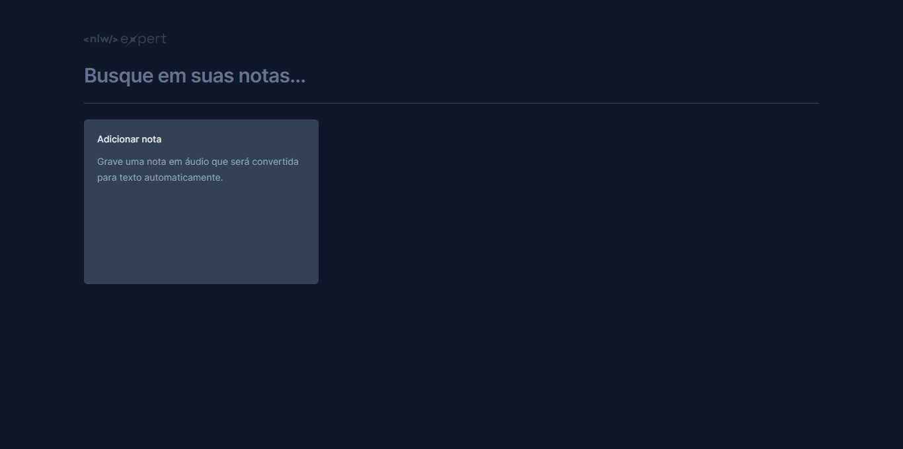
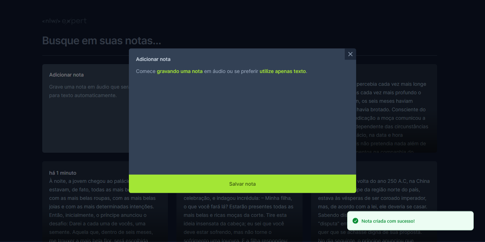
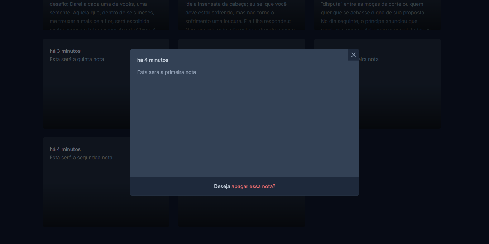
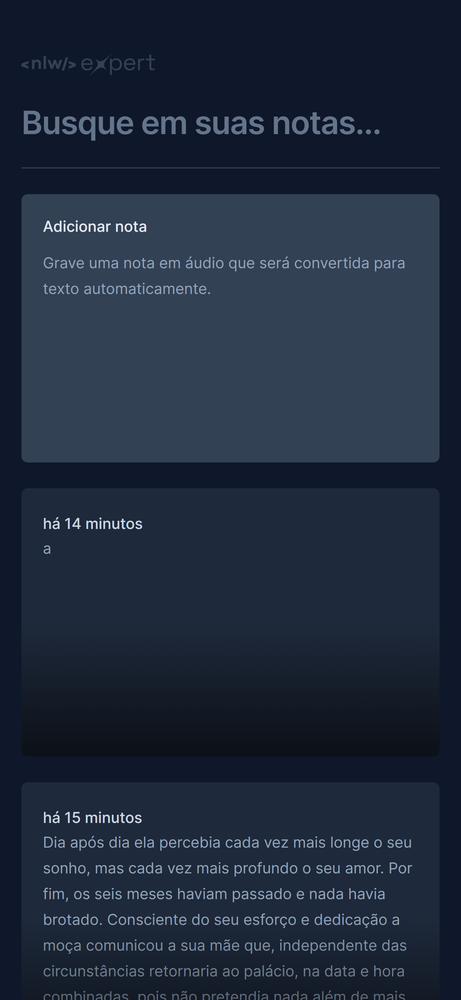
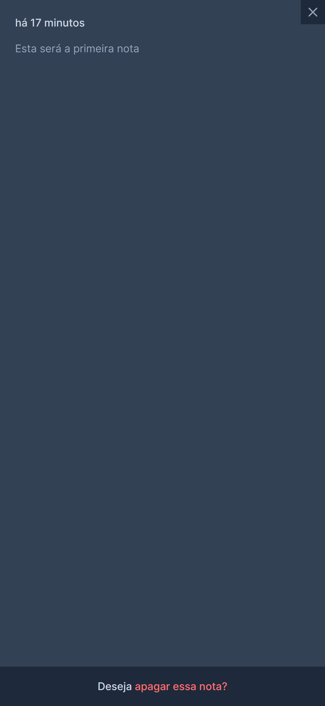
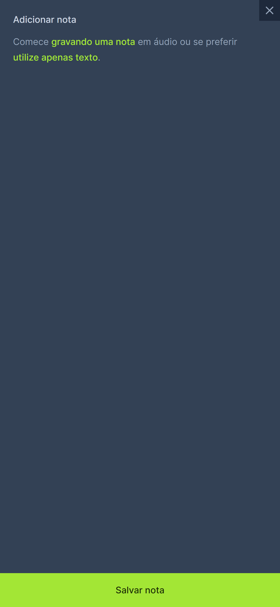

# EXPERT NOTES

## Finalidade
- Site para criação de notas por texto e aúdio.

## 👨‍💻Funcionalidade 
- [X] Projeto feito com React, Typescript, Tailwind e a SpeechRecognition API.

- [x] O usuário pode gravar a nota ou escrevê-la e fazer o salvamento.

- [X] Barra de pesquisa funcional.

# Prints

## 🖥️Versão Desktop


 <hr>

### 📱Versão Mobile


 <hr>

## 💻como rodar esse projeto?

```bash
npm install
npm run dev
```

Acesse [http://localhost:5173](http://localhost:5173) para visualizar a aplicação.

## 🔧Tecnologias Utilizadas 
1. [React](https://react.dev/)<hr>
2. [TypeScript](https://www.typescriptlang.org/)<hr>
3. [Tailwind CSS](https://tailwindcss.com/)<hr>
4. [Visual Studio Code](https://code.visualstudio.com)<hr>
5. [Figma](https://www.figma.com/)<hr>


